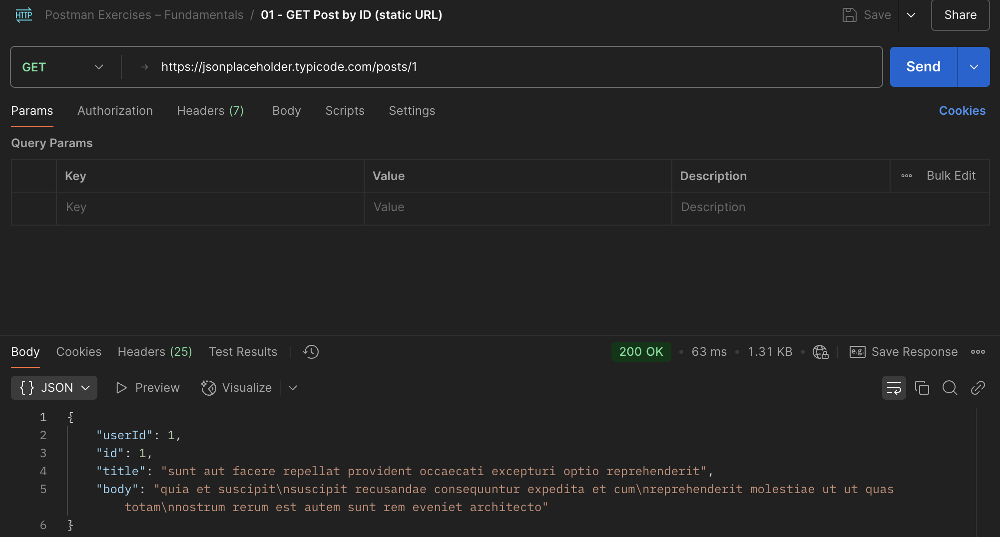

# 🟢 Ejercicio 1 — GET Request a una API pública


> Realizar una petición `GET` a una API pública, inspeccionar el JSON de respuesta y verificar el código de estado HTTP. Este ejercicio es la base para entender cómo trabajan los endpoints de solo lectura.

---

### 🔗 Endpoint utilizado

**GET** https://jsonplaceholder.typicode.com/posts/1

---

### 🧪 Pasos realizados

1. Abrimos Postman y creamos una nueva petición.
2. Seleccionamos el método `GET`.
3. Pegamos la URL anterior como endpoint.
4. Pulsamos **Send**.

---

### ✅ Resultado esperado

- **Status code:** `200 OK`
- **Response body (JSON):**
```json
  {
    "userId": 1,
    "id": 1,
    "title": "sunt aut facere repellat provident occaecati excepturi optio reprehenderit",
    "body": "quia et suscipit\nsuscipit recusandae consequuntur expedita et cum..."
  }
```

## 📸 Captura


---

### 🧠 Observaciones técnicas
- Este endpoint simula datos típicos de un GET /posts/:id.
- Ideal para pruebas de integración en frontends o mobile sin necesidad de backend real.
- No requiere autenticación ni cabeceras especiales.
