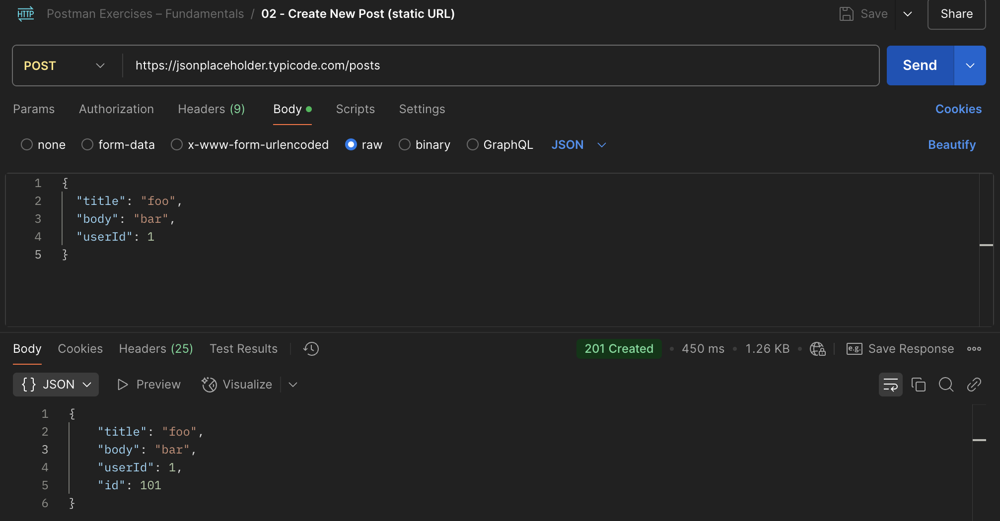

# 🟠 Ejercicio 2 – Enviar una POST Request
> Realizar una petición `POST` a una API de prueba, enviando datos en formato JSON.  
> Este ejercicio introduce el uso del cuerpo de la petición (`Body`) y la creación de recursos.

## 🧩 Endpoint utilizado

**POST** https://jsonplaceholder.typicode.com/posts

## 🛠 Pasos realizados

1. Abrir Postman.
2. Crear una nueva request.
3. Seleccionar el método `POST`.
4. Pegar la URL del endpoint.
5. Ir a la pestaña **Body**:
   - Elegir `raw`
   - Seleccionar `JSON` (en el menú desplegable de tipo)
6. Pegar el siguiente JSON:

```json
{
  "title": "New post",
  "body": "This is the content",
  "userId": 1
}
```

### 📸 Captura



### 🧠 Observaciones técnicas
- Esta API es mock, no crea nada en el servidor: devuelve un objeto simulado con un id autogenerado.
- Útil para validar payloads sin consecuencias reales.
- Este tipo de petición es la base para create en CRUD.
