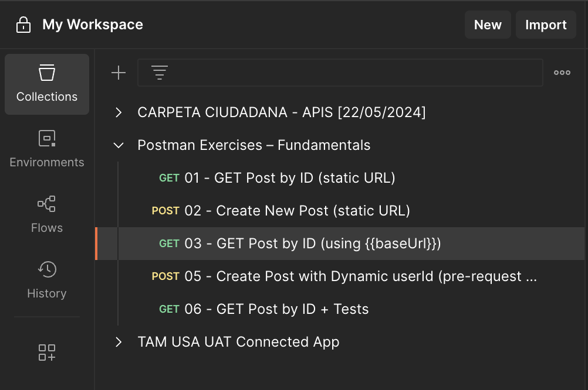

# 🔵 Ejercicio 4 – Agrupar peticiones en una colección

> Organizar y reutilizar peticiones agrupándolas en una colección de Postman.  
> Este ejercicio introduce una estructura modular para escenarios de testing, documentación y ejecución automatizada.

---

## 🧩 Endpoint utilizado

Colección con varias peticiones:  
- **GET** {{baseUrl}}/posts/1  
- **POST** {{baseUrl}}/posts

---

## 🛠 Pasos realizados

1. Abrir Postman.
2. Ir a la sección **Collections** (barra lateral izquierda).
3. Crear una nueva colección llamada: `My first collection`.
4. Mover o guardar las peticiones de ejercicios anteriores (GET y POST) dentro de esta colección.
5. Asegurarse de que ambas usan la variable `{{baseUrl}}`.
6. Guardar la colección.

### 📸 Captura

---

## 🧠 Observaciones técnicas
- Las colecciones permiten agrupar y versionar conjuntos de peticiones relacionadas.
- Se pueden exportar en formato `.postman_collection.json` y compartir entre equipos.
- Es la base para automatizaciones con el Runner o herramientas externas como Newman.
