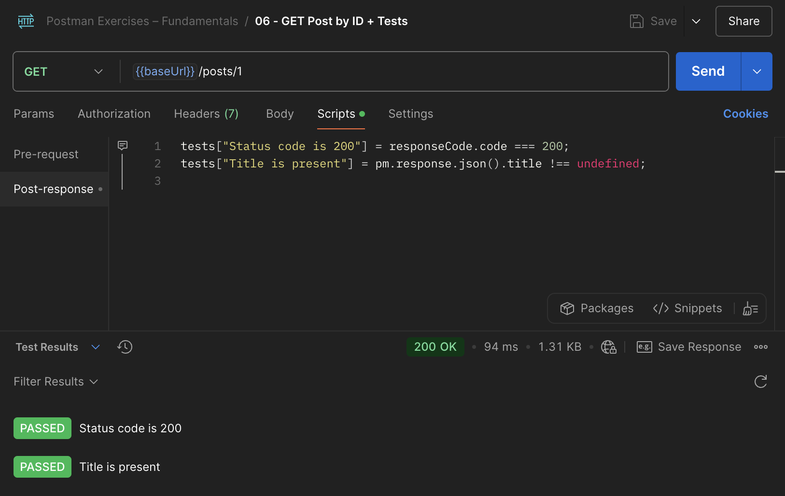

# 🟤 Ejercicio 6 – Validar respuestas con Tests en Postman
> Añadir validaciones automáticas en la pestaña **Tests**, utilizando JavaScript.  
> Este ejercicio permite comprobar que la API responde correctamente sin intervención manual.

## 🧩 Endpoint utilizado
**GET** {{baseUrl}}/posts/1

## 🛠 Pasos realizados

1. Abrir la petición `GET` del ejercicio 1.
2. Ir a la pestaña **Tests**.
3. Añadir el siguiente código:

```javascript
tests["Status code is 200"] = responseCode.code === 200;
tests["Title is present"] = pm.response.json().title !== undefined;
```
4.	Pulsar **Send** para lanzar la petición.
5.	Observar los resultados en la pestaña **Test Results**.

### 📸 Captura


### 🧠 Observaciones técnicas
- Los tests se escriben en JavaScript usando la API de pm.
- Se pueden validar status codes, cabeceras, tiempo de respuesta o contenido del body.
- Ideal para incluir en flujos automatizados o CI con Newman.
